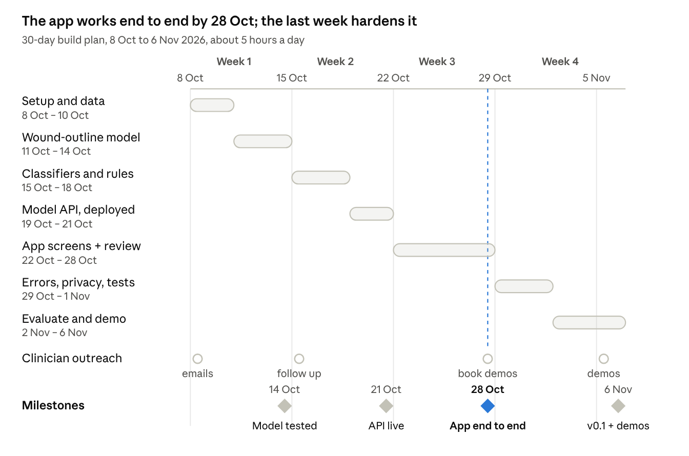
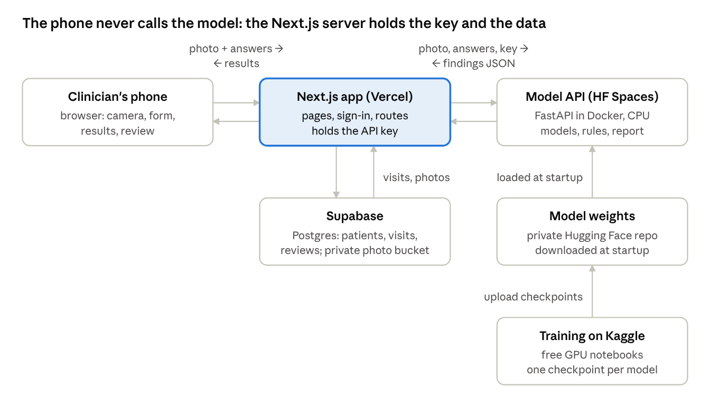

# 30-day build plan

Exported 7 Oct 2026 from the shared roadmap doc. The long-term plan (clinical partner,
validation, regulation) is in [roadmap.md](roadmap.md); the wound flowcharts that define
the labels and rules are in [wound_flowcharts.md](wound_flowcharts.md).

By Friday 6 November you will have a working, deployed research prototype. A clinician signs in on a phone, photographs a wound with the calibration sticker, answers the intake questions, and gets back the wound outline, size, type, flags and a draft report to approve or edit. It is trained on public data only and labelled "research prototype, not for patient care" until the clinical steps in the main roadmap are done.

**What exists on Day 30**

- Wound-outline model, wound-type classifier and pressure-injury stage model, each with test results
- The flowchart rules: danger signs first, the diabetic-foot rule, "blood flow not assessed"
- The model API running on a public HTTPS address
- The app: login, photo capture, intake questions, results, clinician review, wound history
- An evaluation report, a model card and a 3-minute demo video
- Demo meetings booked with clinicians

**Assumptions** (change any of these and the plan shifts)

| Item | Assumption |
| --- | --- |
| Time | About 5 hours a day; weekends absorb slippage |
| Compute | Free Kaggle GPUs for training; CPU for running the model |
| Data | Public datasets only; no real patient photos before ethics approval |
| App | Next.js (App Router, TypeScript) + Prisma + Postgres, used in the phone browser; a React Native or Flutter app would change Week 3 only |
| Model service | The FastAPI server from the starter code, in Docker |
| Hosting | Free tiers: Vercel for the app, Hugging Face Spaces for the API, Neon or Supabase for the database. Check each one's current limits on Day 1 |

**How to read each day:** tick the tasks as you go; a day is finished when its "Done when" line is true. Days 7, 14 and 21 are buffer days: catch up first, and only then do the stretch task.

## At a glance



Each bar is one block of days below. Clinician outreach runs alongside the build, because the demo meetings in the last week only happen if the first emails go out on Day 1.

## Week 1 (8–14 Oct): setup, data, first model

Goal: a trained wound-outline model with honest test results, and proof that size measurement works on your own phone.

### Day 1 · Thu 8 Oct: set up everything

- [ ] Unzip `wound-ai.zip`, create a private GitHub repo, push it.
- [ ] Make a Python 3.11+ virtual environment, install `torch` and `torchvision`, then `pip install -r requirements.txt`.
- [ ] Run `python scripts/smoke_test.py`.
- [ ] Create accounts: Kaggle (verify your phone number, or GPUs stay locked), Hugging Face, Vercel, Neon or Supabase. Write each free-tier limit into the README.
- [ ] Apply for DFUC dataset access at the [DFU Challenge site](https://dfu-challenge.github.io/). Approval can take days, so nothing in this plan waits for it.
- [ ] Email five clinicians (diabetic foot, plastic surgery/burns, dermatology, wound-care nursing):

> Subject: 20 minutes of feedback on a wound-photo tool (DTU project)
>
> I'm a final-year student at DTU building a tool that measures wounds from phone photos and drafts a structured note for a clinician to approve. Could I show you a short demo in early November? If it looks useful, I'd like to explore a formal, ethics-approved collaboration.

**Done when:** the smoke test passes on your laptop and the repo is on GitHub.

### Day 2 · Fri 9 Oct: get the public data

- [ ] Download FUSeg and the AZH wound-type set (both on GitHub from uwm-bigdata), PIID (pressure-injury stages) and the Mendeley lower-limb set.
- [ ] Upload each one as a *private* Kaggle dataset.
- [ ] Open 20 images from each. Note image size, mask format (0/255 or 0/1), folder names and obvious duplicates in `docs/data_notes.md`.

**Done when:** four private Kaggle datasets exist and each has a short description in your notes.

### Day 3 · Sat 10 Oct: build the manifest

- [ ] Edit `configs/azh_map.json` to the real AZH folder names.
- [ ] In a Kaggle notebook, run:

```bash
python scripts/prepare_data.py \
  --pairs fuseg:/kaggle/input/fuseg/train/images:/kaggle/input/fuseg/train/labels \
  --classes azh:/kaggle/input/azh:wound_type:configs/azh_map.json piid:/kaggle/input/piid:pu_stage \
  --out /kaggle/working/manifest.csv
```

- [ ] Check the printed table: train/val/test counts per source. Open five near-duplicate groups and confirm they really are the same wound.
- [ ] Save `manifest.csv` as a Kaggle dataset so every later notebook uses the same split.

**Done when:** one manifest, split by patient group, that every notebook reads.

### Day 4 · Sun 11 Oct: fast baseline run

- [ ] Kaggle notebook, GPU on, a quick U-Net at low resolution:

```bash
python scripts/train_seg.py --manifest /kaggle/input/manifest/manifest.csv --task boundary \
  --arch unet --encoder resnet34 --size 256 --epochs 20 --out /kaggle/working/runs/unet_baseline
```

- [ ] Read `history.csv`: loss should fall and validation Dice rise. If Dice stays near 0, check the mask values first.

**Done when:** you have a baseline validation Dice you trust.

### Day 5 · Mon 12 Oct: the real outline model

- [ ] Train SegFormer-B2 at 512 px; if the session ends, rerun the same command with `--resume`:

```bash
python scripts/train_seg.py --manifest /kaggle/input/manifest/manifest.csv --task boundary \
  --arch segformer --encoder mit_b2 --size 512 --batch-size 8 --epochs 60 --out /kaggle/working/runs/boundary
```

- [ ] Save the output as a Kaggle dataset (`boundary.pt` and `history.csv`).

**Done when:** `boundary.pt` beats the Day 4 baseline on validation Dice.

### Day 6 · Tue 13 Oct: test it and study the failures

- [ ] Run `scripts/evaluate.py` on the test split with `--group-cols source`.
- [ ] Open the 20 lowest-Dice test images. Tag each failure: glare, tiny wound, dark skin, blur, odd framing, bad label.
- [ ] Pick one fix to try in Week 4 (for example stronger glare augmentation).

**Done when:** README has a results table (Dice with 95% confidence interval, per source) and a list of failure types.

### Day 7 · Wed 14 Oct: buffer, then check measurement

- [ ] Catch up on anything unfinished.
- [ ] `python scripts/make_marker.py`, print at 100%, check the 50 mm bar with a ruler.
- [ ] Cut a red paper shape of known size (say 4 × 3 cm). Photograph it beside a sticker, once from straight above and once at about 30°.
- [ ] Write `scripts/check_measure.py`: threshold the red colour to make a mask, then call `find_marker` and `measure_wound`.
- [ ] Stretch: compare U-Net and SegFormer on the test split.

**Done when:** measured area is within about 5% of the true area at both angles.

**Week 1 milestone:** outline model with test results; measurement checked on your own phone.

## Week 2 (15–21 Oct): classifiers, rules, live API

Goal: a public HTTPS API that turns a photo plus intake answers into findings, flags and a draft report.

### Day 8 · Thu 15 Oct: wound-type classifier

- [ ] Train on the AZH types. Add `--meta-cols body_location` only if your copy of the dataset has body locations:

```bash
python scripts/train_cls.py --manifest /kaggle/input/manifest/manifest.csv --target wound_type \
  --backbone convnext_tiny.fb_in22k --size 384 --out /kaggle/working/runs/wound_type
```

- [ ] Read `val_report.json`: sensitivity per class, calibration before and after temperature scaling.
- [ ] Follow up with clinicians who haven't replied.

**Done when:** `wound_type.pt` is saved with macro F1 and per-class sensitivity recorded in README.

### Day 9 · Fri 16 Oct: pressure-injury stage model

- [ ] Same script, `--target pu_stage --size 288` (PIID images are only 299 px, so don't upscale much).
- [ ] Run `evaluate.py` for both classifiers on the test split. Note which classes and stages get confused with each other.

**Done when:** `pu_stage.pt` exists with test results and a note on its main confusions.

### Day 10 · Sat 17 Oct: code the flowchart rules

- [ ] **Danger signs first** (`report.py`): fever with spreading redness or pus, dark or cold toes, chemical or electrical burns. If any fires, the response leads with "Emergency care now".
- [ ] **Diabetic-foot rule** (`pipeline.py`): diabetes = yes and a foot location means wound type = diabetic foot ulcer, whatever the classifier says. Keep the classifier's guess as a secondary line.
- [ ] **"Blood flow not assessed"** flag for every leg or foot ulcer unless an ABPI value is supplied.
- [ ] **Mandatory answers** (`api/server.py`): return HTTP 400 if `diabetes` or `cause` is missing.
- [ ] One pytest test per rule in `tests/test_rules.py`.

**Done when:** `pytest` passes and every rule has its own test.

### Day 11 · Sun 18 Oct: run the whole pipeline and read the reports

- [ ] Put `boundary.pt`, `wound_type.pt` and `pu_stage.pt` in `checkpoints/`.
- [ ] Write `scripts/batch_report.py`: run `WoundAnalyzer` on 30 test images with sample intake answers and save each report.
- [ ] Read all 30. Fix confusing wording, check the numbers match the findings, and check that low-confidence cases say UNCERTAIN.
- [ ] Add the outline to the response: simplify the mask contour (`cv2.approxPolyDP`), scale points to 0–1, return them as `outline`. The app needs this to draw the outline over the photo.

**Done when:** 30 reports read, issues fixed, and the findings include `outline`.

### Day 12 · Mon 19 Oct: put the API in Docker

- [ ] Write a `Dockerfile`: `python:3.11-slim`, the CPU build of PyTorch, `requirements.txt`, the code and checkpoints, and `uvicorn api.server:app --host 0.0.0.0 --port 7860` (7860 is the Hugging Face Spaces default).
- [ ] Add an API-key check (an `X-API-Key` header compared with an environment variable) and limit CORS to your Vercel domain.
- [ ] Build and run it locally, then test:

```bash
curl -H "X-API-Key: $API_KEY" -F image=@sample.jpg \
  -F 'intake={"body_location":"heel","diabetes":"no","cause":"pressure_lying_or_sitting"}' \
  http://localhost:7860/analyze
```

**Done when:** the container returns findings, flags, outline and report for a test image.

### Day 13 · Tue 20 Oct: deploy the API

- [ ] Create a Hugging Face Space (Docker SDK). Make it private if your plan allows; the API key protects it either way.
- [ ] Keep checkpoints in a private Hugging Face model repo and download them at startup with an `HF_TOKEN` secret, so model files stay out of Git.
- [ ] Add secrets `API_KEY` and `HF_TOKEN`, push, and watch the build logs.
- [ ] Time `/analyze` on 10 images and time a cold start after the Space sleeps. Record both in README.

**Done when:** a public HTTPS URL answers `/health` and `/analyze`.

### Day 14 · Wed 21 Oct: buffer

- [ ] Catch up.
- [ ] Stretch: if you got a tissue-labelled dataset, train the tissue model (`train_seg.py --task tissue --init` the boundary model). Otherwise tissue mix stays "not assessed" in the prototype.

**Week 2 milestone:** the live API turns a photo and answers into findings, flags, an outline and a draft report.

## Week 3 (22–28 Oct): build the app and connect it

Goal: on a phone, a clinician can sign in, pick a patient, photograph a wound, answer the questions, see the result and review the draft. The exact API contract and database schema are in the Integration reference section below.

### Day 15 · Thu 22 Oct: app skeleton

- [ ] `npx create-next-app@latest wound-app --typescript --app --tailwind`
- [ ] Supabase project: Postgres for data, a *private* Storage bucket for photos. Add Prisma, paste the schema from the reference section, run `npx prisma migrate dev`.
- [ ] Auth.js (NextAuth) with clinician accounts only; add a `role` field (clinician, admin).
- [ ] Environment variables: `DATABASE_URL`, `WOUND_API_URL`, `WOUND_API_KEY`. Never prefix the key with `NEXT_PUBLIC_`; only server code may call the model API.
- [ ] Connect the repo to Vercel so every push gets a preview URL.

**Done when:** you can sign in on your phone at the Vercel preview URL.

### Day 16 · Fri 23 Oct: patients and wounds

- [ ] Patient list and "new patient": a pseudonymous code (P-0001), age band, sex, diabetes yes/no. No names in the prototype.
- [ ] Wound list per patient: body location and a label ("left heel").
- [ ] Visit = one photo + answers + result for one wound on one date.

**Done when:** you can create a patient and a wound and see them listed.

### Day 17 · Sat 24 Oct: photo capture screen

- [ ] A guide card before the camera opens: sticker beside the wound, phone parallel to the skin at 30–40 cm, no flash, whole sticker in frame.
- [ ] `<input type="file" accept="image/*" capture="environment">` opens the rear camera on phones.
- [ ] Preview with "Retake" and "Use photo".
- [ ] Before upload, redraw the image on a canvas at most 2048 px on the long side and export JPEG. This shrinks the upload and drops location data stored in the photo.

**Done when:** on your phone you can take, preview and confirm a photo.

### Day 18 · Sun 25 Oct: intake form

- [ ] A route handler fetches `GET /intake/questions` from the model API (server side, with the key).
- [ ] Render choice, number and text questions; make `diabetes` and `cause` required.
- [ ] Pre-fill diabetes and body location from the patient and wound records.
- [ ] After the first result, show any `follow_up_questions` and let the clinician answer them and re-run.

**Done when:** the form produces exactly the intake JSON the API expects.

### Day 19 · Mon 26 Oct: connect to the model

- [ ] Route handler `POST /api/visits`: receive photo + answers, upload the photo to the private bucket, forward both to the model API's `/analyze` with the key, save the visit and findings, return the visit id.
- [ ] Send the wound's previous area, so the API can work out the % change.
- [ ] Handle every status: `retake` (show the quality-gate messages), `no_wound_found`, danger signs, `ok`.
- [ ] Cold starts: on a timeout show "waking up the model" and retry once.

**Done when:** a photo taken on your phone becomes a saved visit with findings in the database.

### Day 20 · Tue 27 Oct: results screen

- [ ] Flags first: urgent in red, review in amber.
- [ ] The photo with the wound outline drawn as an SVG polygon from `outline`.
- [ ] Findings: type with confidence (UNCERTAIN shown as such), size, stage, "blood flow not assessed".
- [ ] The draft report under a fixed banner: "AI draft for clinician review, not a diagnosis".

**Done when:** a full result is readable on a phone without zooming.

### Day 21 · Wed 28 Oct: clinician review and wound history

- [ ] Review panel: Approve, Edit (text box pre-filled with the draft) or Reject with a reason. Save reviewer, time and final text, and also send it to the API's `/review`.
- [ ] Wound history: visits in date order and a small chart of area over time.
- [ ] Send screenshots to the clinicians who replied and book 20-minute demos for 5–6 Nov.
- [ ] Catch up on anything unfinished this week.

**Done when:** you can review a draft and see a wound's size trend across two visits.

**Week 3 milestone:** the whole flow works on a phone: sign in, patient, photo, questions, result, review.

## Week 4 (29 Oct–6 Nov): harden, test, evaluate, demo

Goal: a prototype that fails gracefully, is tested automatically, has honest documentation, and has been shown to clinicians.

### Day 22 · Thu 29 Oct: errors and edge cases

- [ ] Clear screens for: retake (quality-gate message), no wound found, model API down (keep the photo and offer retry), slow network (upload progress).
- [ ] Disable the submit button while a visit is processing, so one tap never creates two visits.
- [ ] Test by stopping the API and by switching the phone to airplane mode mid-upload.

**Done when:** every failure shows a clear message and nothing crashes.

### Day 23 · Fri 30 Oct: privacy and security basics

- [ ] Every page and route requires sign-in; admin pages check the role.
- [ ] Photos are served only through short-lived signed URLs from the private bucket.
- [ ] Neither the app nor the API logs photos or answers.
- [ ] "Delete visit" and "delete patient" also delete the photos.
- [ ] A permanent "research prototype, not for patient care" banner.
- [ ] Rotate the API key and re-check CORS.

**Done when:** a signed-out browser cannot reach any page, photo URL or API route.

### Day 24 · Sat 31 Oct: automated tests

- [ ] API: `pytest` for the rules, plus an `/analyze` test on a sample image.
- [ ] App: one Playwright test that signs in, creates a patient, uploads a sample photo (`setInputFiles`), sees the result and approves it.
- [ ] GitHub Actions: run the smoke test, `pytest` and the Playwright test on every push.

**Done when:** CI is green on `main`.

### Day 25 · Sun 1 Nov: hallway test

- [ ] Five classmates, their own phones, a red paper shape as a stand-in wound with a sticker. No real wounds until ethics approval.
- [ ] Count retakes, time each visit, and note every screen where someone hesitated.
- [ ] Send 50 public test images through the deployed app and check the results match `evaluate.py` offline.

**Done when:** you have the top five usability problems, and deployed results match offline results.

### Day 26 · Mon 2 Nov: fix and improve

- [ ] Fix the top usability problems.
- [ ] If time allows, try the model fix chosen on Day 6. Retrain, evaluate on the *same* test split, and ship only if it's better.

**Done when:** fixes are merged, and any new model has test results at least as good as the old one.

### Day 27 · Tue 3 Nov: evaluation report and model card

- [ ] `docs/evaluation.md`: each model's metrics with 95% confidence intervals and per-source results, the measurement check, response times, known failure types.
- [ ] `docs/model_card.md`: intended use (research prototype), training data, results, limits (no clinical validation, public data, skin-tone mix unknown, bedside checks not assessed), how to report problems.

**Done when:** someone who reads only these two files knows what works and what doesn't.

### Day 28 · Wed 4 Nov: demo materials

- [ ] A demo account with three patients built from public test images.
- [ ] A 3-minute video: the problem, capture, result, review, history, limitations.
- [ ] README with screenshots, the architecture diagram and setup steps.

**Done when:** the video and README are ready to share by private link.

### Day 29 · Thu 5 Nov: clinician demos

- [ ] Demo to the clinicians booked on Day 21.
- [ ] Ask four questions: Which outputs are useful? What is wrong? What would you need to trust it? Would you co-lead an ethics application for a data-collection study?
- [ ] Write the answers into a feedback table in the repo.

**Done when:** you have written feedback from at least two clinicians.

### Day 30 · Fri 6 Nov: retrospective and next month

- [ ] Check the "What exists on Day 30" list at the top of this file.
- [ ] Rank the feedback and write next month's plan; it usually starts with Phase 0 of the main roadmap (ethics application and capture protocol).
- [ ] Tag release `v0.1`.

**Done when:** `v0.1` is tagged and next month's plan is written.

**Week 4 milestone:** a deployed, tested, documented prototype that clinicians have seen.

## Integration reference

The phone never talks to the model directly: it talks to your Next.js server, which holds the API key, stores the photo and data, and calls the model API.



**Model API contract** (every request carries the `X-API-Key` header, added on Day 12)

| Endpoint | Sent | Returned |
| --- | --- | --- |
| `GET /health` | nothing | model versions |
| `GET /intake/questions` | nothing | the core questions with their options |
| `POST /intake/follow-ups` | `{answers, predicted_type}` | extra questions for burns, surgical, pressure, diabetic |
| `POST /analyze` | form data: `image` (JPEG), `intake` (JSON text; `diabetes` and `cause` required), `previous` (JSON: `area_cm2`, `days_ago`, optional) | `status`, `flags`, `wound_type`, `severity`, `measurement`, `change`, `outline` (list of polygons, points `[x, y]` scaled 0–1; `null` without a boundary model), `report_markdown`, `follow_up_questions`, `model_versions`, `case_id` |
| `POST /review` | `{case_id, reviewer_id, decision, final_summary, corrections}` | `{ok}` |

`status` is one of `ok`, `retake` (with `quality.issues` to show the user) or `no_wound_found`.

**Database schema** (Prisma; add the Auth.js adapter tables alongside)

```prisma
model User {
  id      String   @id @default(cuid())
  email   String   @unique
  name    String?
  role    Role     @default(CLINICIAN)
  reviews Review[]
}

enum Role {
  CLINICIAN
  ADMIN
}

model Patient {
  id        String   @id @default(cuid())
  code      String   @unique // pseudonym such as P-0001; no names
  ageBand   String?
  sex       String?
  diabetes  Boolean?
  wounds    Wound[]
  createdAt DateTime @default(now())
}

model Wound {
  id           String  @id @default(cuid())
  patientId    String
  patient      Patient @relation(fields: [patientId], references: [id], onDelete: Cascade)
  bodyLocation String
  label        String?
  visits       Visit[]
}

model Visit {
  id            String   @id @default(cuid())
  woundId       String
  wound         Wound    @relation(fields: [woundId], references: [id], onDelete: Cascade)
  takenAt       DateTime @default(now())
  photoPath     String // key in the private storage bucket
  intake        Json
  status        String // ok | retake | no_wound_found
  findings      Json?
  areaCm2       Float?
  draftReport   String?
  modelVersions Json?
  review        Review?
}

model Review {
  id          String   @id @default(cuid())
  visitId     String   @unique
  visit       Visit    @relation(fields: [visitId], references: [id], onDelete: Cascade)
  reviewerId  String
  reviewer    User     @relation(fields: [reviewerId], references: [id])
  decision    String // approved | edited | rejected
  finalReport String?
  reason      String?
  createdAt   DateTime @default(now())
}
```

**Server: create a visit** (`app/api/visits/route.ts`, Day 19). The photo is stored only after the model has answered, so failed calls leave nothing behind.

```ts
import { NextResponse } from "next/server";
import { auth } from "@/auth";
import { prisma } from "@/lib/prisma";
import { uploadPhoto } from "@/lib/storage"; // private bucket upload, returns the object key

export async function POST(req: Request) {
  const session = await auth();
  if (!session) return NextResponse.json({ error: "unauthorised" }, { status: 401 });

  const form = await req.formData();
  const photo = form.get("photo") as File;
  const woundId = String(form.get("woundId"));
  const intake = String(form.get("intake"));

  const previous = await prisma.visit.findFirst({
    where: { woundId, areaCm2: { not: null } },
    orderBy: { takenAt: "desc" },
  });

  const body = new FormData();
  body.append("image", photo);
  body.append("intake", intake);
  if (previous?.areaCm2) {
    const days = Math.round((Date.now() - previous.takenAt.getTime()) / 86_400_000);
    body.append("previous", JSON.stringify({ area_cm2: previous.areaCm2, days_ago: days }));
  }

  const res = await fetch(`${process.env.WOUND_API_URL}/analyze`, {
    method: "POST",
    headers: { "X-API-Key": process.env.WOUND_API_KEY! },
    body,
    signal: AbortSignal.timeout(60_000), // covers a cold start
  });
  if (!res.ok) return NextResponse.json({ error: "model unavailable" }, { status: 502 });
  const f = await res.json();

  const photoPath = await uploadPhoto(photo, woundId);
  const visit = await prisma.visit.create({
    data: {
      woundId,
      photoPath,
      intake: JSON.parse(intake),
      status: f.status,
      findings: f,
      areaCm2: f.measurement?.area_cm2 ?? null,
      draftReport: f.report_markdown ?? null,
      modelVersions: f.model_versions,
    },
  });
  return NextResponse.json({ visitId: visit.id, status: f.status });
}
```

**Phone: prepare the photo** (Day 17). Fixes rotation, shrinks the file and drops the photo's metadata (including location).

```ts
export async function preparePhoto(file: File): Promise<Blob> {
  const bmp = await createImageBitmap(file, { imageOrientation: "from-image" });
  const scale = Math.min(1, 2048 / Math.max(bmp.width, bmp.height));
  const canvas = document.createElement("canvas");
  canvas.width = Math.round(bmp.width * scale);
  canvas.height = Math.round(bmp.height * scale);
  canvas.getContext("2d")!.drawImage(bmp, 0, 0, canvas.width, canvas.height);
  return new Promise((resolve) => canvas.toBlob((b) => resolve(b!), "image/jpeg", 0.92));
}
```

**Results: draw the outline** (Day 20). `outline` holds points scaled 0–1, so the polygon fits any screen size.

```tsx
export function WoundOverlay({ src, outline }: { src: string; outline: [number, number][] }) {
  const points = outline.map(([x, y]) => `${x * 100},${y * 100}`).join(" ");
  return (
    <div className="relative w-full">
      
      <svg viewBox="0 0 100 100" preserveAspectRatio="none" className="absolute inset-0 h-full w-full">
        <polygon points={points} fill="none" stroke="lime" strokeWidth={2} vectorEffect="non-scaling-stroke" />
      </svg>
    </div>
  );
}
```

These are sketches to adapt, not tested code: check them against your Next.js, Auth.js and Prisma versions.

## Out of scope, and rules that keep you on schedule

Thirty days buys a working prototype, not a clinical product. These stay for later months, in the order of the main roadmap:

| Not in this month | Why | When |
| --- | --- | --- |
| Real patient photos | Needs ethics approval and consent | After Phase 0 |
| Clinical validation, CDSCO licence | Needs clinical data and a formal study | Phases 3–6 |
| Tissue-mix model | Few public tissue labels | When you have a tissue-labelled set |
| Burn depth | Almost no public burn data | With your clinical partner's data |
| MedGemma summaries | Needs a GPU to run and clinician-approved summaries to tune on | After a few hundred reviewed visits |
| Hindi interface, native app, offline mode | Not needed to prove the concept | After clinician feedback |

**Rules**

1. **End to end first, accuracy second.** A working flow in Week 3 matters more than a slightly better Dice score. Model improvements wait for Week 4.
2. **Time-box every task.** If one overruns by half a day, cut scope and write it on a "later" list; don't let the whole plan slide.
3. **Touch the test split once per model version.** Tune on validation only.
4. **Guard the GPU quota.** Run long jobs overnight, checkpoint every epoch, and keep a few hours of the weekly quota spare for reruns.
5. **Commit daily, tag weekly** (`v0.0.1` on Day 7, `v0.0.2` on Day 14, `v0.0.3` on Day 21, `v0.1` on Day 30), each tag with its test results.
6. **One hour a week for clinicians.** After this month, the clinical partner is the bottleneck, not the code.
