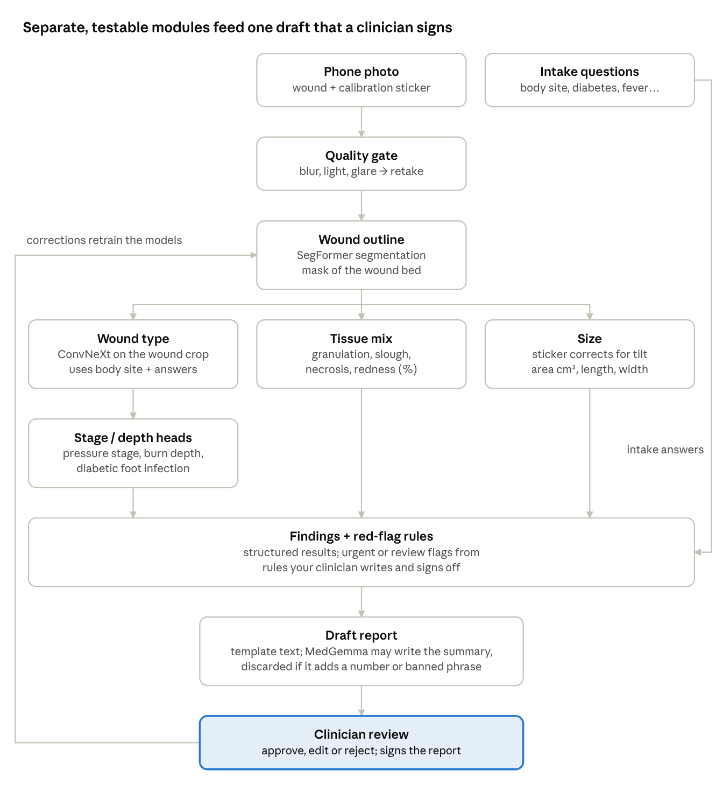
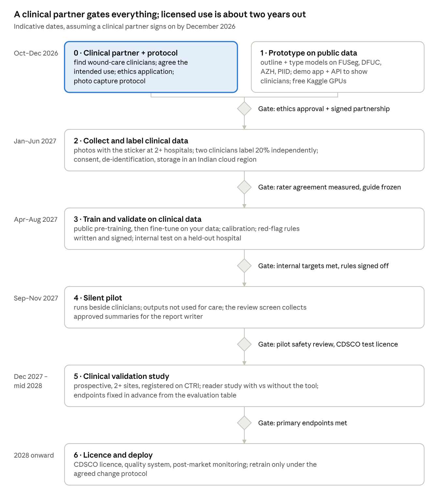

# Wound Assessment AI: Roadmap & Build Guide

Exported 7 Oct 2026 from the shared roadmap doc. Day-by-day plan for the first month:
[30_day_build_plan.md](30_day_build_plan.md). Wound classification flowcharts:
[wound_flowcharts.md](wound_flowcharts.md).

## Reality check: what you are actually building

Build a clinician-assist tool, not an automatic diagnoser: the model drafts the wound report and a qualified clinician approves, edits or rejects it. That framing is what makes "accurate" achievable, legal and safe.

**Draft intended-use statement** (this one sentence decides your regulatory class, so agree it with your clinical partner early):

> Software that measures wound size and estimates wound type, stage or depth and tissue composition from a smartphone photo plus patient answers, producing a draft assessment for review by a qualified clinician in hospital wound clinics.

**How accurate each part can realistically get:**

| Report element | Achievable from a photo | Why |
| --- | --- | --- |
| Wound outline and area in cm² | High | Well-defined task; a printed calibration sticker gives real units |
| Wound type (diabetic, pressure, venous, surgical, burn) | Good | Appearance plus body location separate most types |
| Tissue mix (granulation, slough, necrosis) | Moderate | Colour-based, but lighting and skin tone shift colour |
| Pressure injury stage, burn depth | Limited | Even specialists disagree; visual burn-depth assessment is reported as 60–80% reliable ([source](https://bradscholars.brad.ac.uk/entities/publication/972053ad-1c0c-4c56-af0c-958808618238)) |
| Infection, perfusion, depth, undermining | Partial at best | Needs touch, probing, pulses or labs; the intake questions fill some of the gap |

Your model can never be judged more accurate than the agreement between your own clinicians, so measure that agreement first (Cohen's kappa between two raters on the same photos).

**Your two gaps, and how this plan handles them:**

- **No clinician yet.** Without one you cannot label clinical data, set red-flag rules or validate anything. Phase 0 is finding one; everything before that is a research prototype on public data.
- **Free GPUs only.** Kaggle's free tier (commonly about 30 GPU-hours a week on a 16 GB T4 or P100, quota varies; [source](https://gpuperhour.com/blog/free-cloud-gpus-and-credits)) is enough for every vision model here. It is tight for fine-tuning MedGemma, because those GPUs lack bf16. Use the template report until you have clinician-written summaries, then rent a few hours of an L4/A100 or use cloud credits for that one step.

**Scope advice:** keep all four wound types in the architecture, but validate in two waves. Diabetic foot ulcers and pressure injuries first (most public data, biggest need), then burns and surgical wounds.

## System architecture

Use a chain of small, separately validated models plus rules, not one end-to-end model: when the report is wrong, you can see which module was wrong, and each one can be tested and approved on its own.



Only the last two boxes produce text, and nothing reaches the patient record until a clinician signs it. Every clinician correction is logged and becomes training data for the next model version.

## Data: what exists and what you must collect

Public datasets are enough to prototype and pre-train, but a clinical model has to be trained and tested on images you collect yourself, in Indian clinics, on the phones the app will run on. Public sets come mostly from UK, US, Turkish and Chinese hospitals, so skin tones, lighting and devices differ from your users.

**Public datasets (prototype and pre-training)**

| Dataset | Wound type | Labels | Size | Access |
| --- | --- | --- | --- | --- |
| [DFUC 2022](https://dfuc2022.grand-challenge.org/dataset/) | Diabetic foot ulcer | Clinician-drawn segmentation masks | 2,000 train + 2,000 test photos | Apply via the [DFU Challenge](https://dfu-challenge.github.io/); research licence |
| [DFUC 2021](https://dfu-2021.grand-challenge.org/Dataset/) | Diabetic foot ulcer | Infection, ischaemia, both, neither | 15,683 patches (5,955 labelled train) | Same application |
| [DFUC 2020](https://dfu2020.grand-challenge.org/Dataset/) | Diabetic foot ulcer | Bounding boxes | 2,000 train + 200 validation | Same application |
| [FUSeg 2021](https://doi.org/10.3390/info15030140) | Foot ulcer | Pixel masks | 1,210 images, 889 patients | [GitHub](https://github.com/uwm-bigdata/wound-segmentation); check terms |
| [AZH wound set](https://arxiv.org/pdf/2109.06969) | Diabetic, pressure, venous, surgical | Type + body location | 730 images | GitHub (uwm-bigdata); check terms |
| [Medetec](https://pmc.ncbi.nlm.nih.gov/articles/PMC10963767) | Mixed chronic | Type | 358 images | Check terms |
| [PIID](https://arxiv.org/pdf/2510.24980) | Pressure injury | Stage I–IV, labelled by doctors | 1,091 images, 299×299 px | Public research set |
| [Lower Limb and Feet Wound](https://data.mendeley.com/datasets/hsj38fwnvr) | Feet and lower limb | Wound vs healthy + 2,686 masks | 8,129 images, 331×331 px | CC BY 4.0 |
| [WoundTissue](https://arxiv.org/abs/2502.10652v1) | Mixed | 6 tissue types (slough, granulation, maceration, necrosis, bone, tendon) | 147 images | Check availability |
| Burns ([BIP_US](https://arxiv.org/pdf/2103.01361)) | Burn | 3 depth classes | 94 images | Small; burns need your own data |

Read every licence before any commercial use; challenge data is usually licensed for research. Low-resolution sets (PIID, Mendeley) are fine for pre-training but not for measurement.

**Your clinical dataset (the one that matters)**

- **Who and how many:** aim for a few hundred patients per wound type, several visits each, from at least two hospitals. Hold one hospital back entirely as the external test set.
- **How photos are taken:** the app's own capture screen, calibration sticker beside the wound, camera roughly parallel to the wound at 30–40 cm, no flash. That matches how the DFUC images were captured ([source](https://dfu-2021.grand-challenge.org/Dataset/)).
- **Labels per photo:** wound type; stage or grade on a named scale (NPIAP for pressure injuries; your clinician's choice of Wagner, University of Texas or SINBAD for diabetic feet; depth category for burns); outline mask; tissue mask; ruler length × width and a manual tracing (ground truth for measurement).
- **Context per photo:** patient ID, visit date, body location, Fitzpatrick skin type, phone model, and the intake answers. Subgroup analysis is impossible without these.
- **Agreement:** two clinicians label the same 20% independently; a senior clinician settles disagreements. Write a labelling guideline with example photos before anyone starts.
- **Tools:** CVAT or Label Studio, with Segment Anything (SAM 2 or MedSAM2) for click-to-outline masks so a clinician corrects rather than draws from scratch.

## Roadmap

Start the public-data prototype and the hunt for a clinical partner this month, in parallel; nothing after Phase 1 can begin without that partner.



Dates are indicative and slip one-for-one with the partnership and ethics approval. Phases 2 and 3 overlap: start training as soon as the first few hundred labelled photos exist. A silent pilot (Phase 4) means the tool runs on real cases but nobody acts on its output, which is the cheapest way to find failures before the formal study.

For the first month, day by day, from setup to a working app: [30-day build plan](30_day_build_plan.md)

## How to train it on free GPUs

Train one component per Kaggle session, in this order: wound outline, wound type, stage/depth heads, tissue mix, and only much later the report writer. Every script in the starter code saves each epoch and resumes, so the session time limit never costs you more than one epoch.

1. **Set up a Kaggle notebook.** Accelerator: GPU (T4 or P100, 16 GB). Upload each dataset as a *private* Kaggle dataset. Turn internet on for the first run so pretrained weights download. Copy in the starter code and run `pip install -r requirements.txt` (PyTorch is already installed).
2. **Build one manifest.** `prepare_data.py` merges all sources into one CSV, groups near-duplicate photos of the same wound, and splits train / validation / test by patient. Splitting by image instead leaks the same ulcer into both sides and inflates every number.
3. **Wound outline (segmentation).** SegFormer-B2 at 512 px, batch 8, AdamW, Dice + BCE loss, mixed precision, cosine schedule, early stopping on validation Dice. Train a U-Net baseline too, so you know the bigger model is earning its place.
4. **Wound type (classification).** ConvNeXt-Tiny at 384 px on a crop around the wound, fused with body location and intake answers. Class-weighted loss for rare classes, then temperature scaling on the validation set so a "70% confident" output really is right about 70% of the time.
5. **Stage and depth heads.** The same script with a different target column: `pu_stage` (PIID + your data), `dfu_infection` (DFUC 2021), `burn_depth` (your data). Each head only runs when the wound type matches.
6. **Tissue mix.** The segmentation script with `--task tissue`: granulation, slough, necrosis, epithelial and periwound redness.
7. **Public first, then yours.** Train on public + your data together, then fine-tune for a few epochs on your data alone at a lower learning rate (`--init` loads the earlier checkpoint).
8. **Evaluate once on the test split**, broken down by hospital, phone and skin type. Then study the 20 worst cases with your clinician before changing anything.

```bash
# Kaggle cell, session 1
python scripts/prepare_data.py \
  --pairs fuseg:/kaggle/input/fuseg/images:/kaggle/input/fuseg/labels \
  --classes azh:/kaggle/input/azh:wound_type:configs/azh_map.json piid:/kaggle/input/piid:pu_stage \
  --csv /kaggle/input/clinic/annotations.csv --out /kaggle/working/manifest.csv

python scripts/train_seg.py --manifest /kaggle/working/manifest.csv --task boundary \
  --arch segformer --encoder mit_b2 --size 512 --batch-size 8 --epochs 60 --out /kaggle/working/runs/boundary
# session timed out? same command + --resume

# session 2
python scripts/train_cls.py --manifest /kaggle/working/manifest.csv --target wound_type \
  --backbone convnext_tiny.fb_in22k --meta-cols body_location,cause,diabetes --out /kaggle/working/runs/wound_type

# after training
python scripts/evaluate.py --manifest /kaggle/working/manifest.csv --ckpt-dir checkpoints \
  --group-cols source,fitzpatrick,device --out reports/eval_test.json
```

**Rules that protect your accuracy numbers:**

- Never look at test results while tuning; tune on validation only. Touch the test split once per model version.
- Keep colour augmentation mild. Red, yellow and black *are* the clinical signal; strong hue shifts teach the model that slough can be red.
- Do add blur, glare, JPEG recompression and rotation: that is what WhatsApp-forwarded ward photos look like.
- Log every run (the scripts write `history.csv`; a free Weights & Biases account also works) and keep the checkpoint, data version and commit together. Regulators will ask which data trained which model.

## Intake questions and report writing

The app asks ten core questions with every photo, then follow-ups picked from the answers and the model's first guess; the report itself is assembled by code, and a language model may only write the short summary paragraph.

**Core questions (every photo)**

| Question | What it feeds |
| --- | --- |
| Where on the body is the wound? | Wound-type model (heel/sacrum point to pressure, sole to diabetic, lower leg to venous) |
| How did it start? (pressure, burn, surgery, injury, by itself) | Wound-type model; which follow-ups to ask |
| How long has it been there? | Acute vs chronic; report |
| Diabetes? | Red flags; wound-type model |
| Fever or chills in 48 hours? | Infection red flag |
| Pain now, 0–10 | Report; infection screen |
| Bad smell? Discharge type? | Infection screen |
| Is redness or swelling spreading? | Infection red flag |
| Current dressing or treatment | Report |

**Follow-ups:** burns (cause, hours since, other areas burned), surgical wounds (days since operation, wound opening), pressure injuries (mobility, how often turned), diabetic feet (numbness, cold or darkening toes, previous ulcer or amputation). Your clinician reviews the wording, and it needs a Hindi version before ward use.

**Who writes the report**

| Option | Use it when | Strength | Weakness |
| --- | --- | --- | --- |
| Template (code) | Version 1, and whenever the language model fails its check | Cannot invent anything; easy to validate | Reads stiffly |
| MedGemma 1.5 4B, prompted | Pilot, alongside the template | Fluent; looks at the image too | Google itself says it is not clinical-grade without further tuning ([source](https://developers.google.com/health-ai-developer-foundations/medgemma)) |
| MedGemma + QLoRA on clinician-approved summaries | After a few hundred reviewed cases | Writes like your clinicians | Needs bf16 GPU hours; re-validate after every retrain |

**Guardrails built into the starter code:**

- Numbers, red flags and the disclaimer are rendered from the findings by code, never by the language model.
- The model's summary is thrown away (template used instead) if it contains any number not in the findings, or a banned phrase such as a dose, "diagnosed", "prescribe" or "amputation".
- Below 70% calibrated confidence, a classification is printed as UNCERTAIN with the top three alternatives.
- No size is reported unless the calibration sticker was detected.
- The red-flag rules are placeholders written from general practice. Your clinical partner rewrites and signs off every rule and threshold.
- Every draft goes to a review screen where the clinician approves, edits or rejects it. Edits are logged and become the training data for the summary model.

## Evaluation: proving the report is accurate

Judge each module separately against clinician ground truth, on a hospital the model never saw in training, with 95% confidence intervals and a breakdown by skin type, phone and site. Agree the pass thresholds with your clinical partner *before* anyone looks at test results.

| Module | Metric | Starting target (agree with clinicians) |
| --- | --- | --- |
| Wound outline | Dice vs clinician mask | Mean ≥ 0.85, lower CI bound ≥ 0.80 |
| Wound area | Bias and 95% limits of agreement vs manual tracing | Within about ±10% for wounds over 1 cm² |
| Wound type | Macro F1; sensitivity per class | Macro F1 ≥ 0.80; no class below 0.70 sensitivity |
| Stage / burn depth | Weighted kappa vs adjudicated label | Not worse than your clinicians' agreement with each other |
| Urgent red flags | Sensitivity | ≥ 0.95; a missed urgent case is the worst error, so accept more false alarms |
| Confidence | Expected calibration error | ≤ 0.05 after temperature scaling |
| Report drafts | Share approved unedited; tallied error types | Zero invented numbers; edit rate falling over time |
| Fairness | Any metric by skin type, phone, site | No subgroup far below the overall figure |

`evaluate.py` produces all of these except the report and red-flag rows, which come from the clinical study.

**Clinical validation study (Phase 5)**

- Prospective, consecutive patients at two or more sites, ethics committee approval, protocol registered on the Clinical Trials Registry of India before the first patient.
- Reference standard: in-person assessment by two wound specialists with adjudication, and manual tracing for area.
- Pre-specified primary endpoints; a statistician sets the sample size from the target sensitivity and the confidence-interval width you need.
- A reader study: clinicians with versus without the tool, comparing agreement with the expert reference, time per assessment and documentation completeness.
- Write it up against the AI reporting checklists reviewers expect: TRIPOD+AI for model development and validation, DECIDE-AI for early clinical evaluation.

## Regulation, ethics and privacy in India

A wound-assessment app used on patients is Software as a Medical Device under the Medical Devices Rules, 2017, so it needs CDSCO approval before clinical use; patient photos fall under the DPDP Act; and your study needs ethics approval under ICMR's AI guidelines. This is orientation, not legal advice: bring in a regulatory consultant before the clinical study.

| Rule | What it means for you | When it bites |
| --- | --- | --- |
| [CDSCO Medical Device Software guidance](https://www.digitalhealthnews.com/cdsco-unveils-final-medical-device-software-guidance-bringing-greater-regulatory-clarity-for-digital-health-innovators) (final 2026, after the [21 Oct 2025 draft](https://conventuslaw.com/?p=132429)) | Risk class A–D set by intended use, how much the output drives decisions, and how serious the condition is ([source](https://india-briefing.com/news/cdsco-draft-guidance-medical-software-40691.html)). Expects a quality system, technical file, software bill of materials, cybersecurity and usability validation, AI bias evaluation, a test licence for clinical studies, post-market monitoring, and validation in Indian clinical workflows | Test licence before the clinical study; full licence before clinical use |
| AI model updates | A pre-agreed change protocol for retraining ([source](https://navigator.global/us/library/india-educational-series-new-rules-for-software-as-a-medical-device)) | Every retrain after approval |
| [DPDP Act 2023 and Rules 2025](https://www.mondaq.com/india/privacy-protection/1708830/dpdp-act-compliance-mandate) (notified 13 Nov 2025) | Specific informed consent, security safeguards, breach reporting; health data is sensitive | Design it in now; substantive duties phase in by May 2027 ([source](https://anantamias.com/current-affairs/dpdp-rules-2025-notified/?pdf=1)) |
| [ICMR ethical guidelines for AI in healthcare (2023)](https://www.icmr.gov.in/icmrobject/custom_data/pdf/Ethical-guidelines/Ethical_Guidelines_AI_Healthcare_2023.pdf) | Ethics committee review; patients told that AI is used; clinical and field validation before deployment | Before you collect a single photo |
| [MedGemma terms (HAI-DEF)](https://developers.google.com/health-ai-developer-foundations/terms) | "Clinical use" includes research studies; you must seek regulatory authorisation where applicable, and pass the use restrictions on to anyone you distribute to | Only if MedGemma ships in the product |
| Dataset licences | Challenge datasets are usually research-only | Before training a commercial model on them |

**Build for compliance from day one:**

- Version every model with the exact data and code that trained it (the checkpoints already carry a version string).
- Keep an audit log of every draft and every clinician edit.
- Store patient data in an Indian cloud region; strip GPS and other EXIF data; never photograph faces.
- Follow the usual international standards the regulator will recognise: ISO 13485 (quality system), ISO 14971 (risk management), IEC 62304 (software lifecycle), IEC 62366-1 (usability).

## Learning materials and skills checklist

You already have the software side; the gaps to close are medical-imaging evaluation, wound-care basics and regulation. Tick these off as you go.

**Read first (wound AI)**

- [ ] [Fully automatic wound segmentation with deep CNNs](https://doi.org/10.1038/s41598-020-78799-w) (Wang et al., Scientific Reports 2020)
- [ ] [FUSeg: the Foot Ulcer Segmentation Challenge](https://doi.org/10.3390/info15030140) (2024): what won and why
- [ ] [DFUC 2022 dataset paper](https://arxiv.org/abs/2204.11618v2): how clinicians delineate ulcers
- [ ] [Multi-modal wound classification with image + body location](https://arxiv.org/pdf/2109.06969) (AZH dataset)
- [ ] [Deep learning for wound tissue segmentation](https://arxiv.org/abs/2502.10652v1) (2025)
- [ ] [MedGemma technical report](https://arxiv.org/abs/2507.05201v2) and [MedSAM2](https://arxiv.org/pdf/2504.03600)

**Methods**

- [ ] [SegFormer](https://arxiv.org/abs/2105.15203): the default segmentation model here
- [ ] [On calibration of modern neural networks](https://arxiv.org/abs/1706.04599): temperature scaling and why confidence lies
- [ ] [QLoRA](https://arxiv.org/abs/2305.14314): fine-tuning a 4B model on a 16 GB GPU
- [ ] Patient-level splits, bootstrap confidence intervals, Bland–Altman agreement, Cohen's kappa
- [ ] Google's MedGemma LoRA fine-tuning notebook (linked from the [MedGemma page](https://developers.google.com/health-ai-developer-foundations/medgemma))

**Wound care (ask your clinician to walk you through these)**

- [ ] Wound bed assessment and the TIME framework (tissue, infection, moisture, edge)
- [ ] Pressure injury staging ([NPIAP](https://npiap.com))
- [ ] Diabetic foot guidelines ([IWGDF](https://iwgdfguidelines.org)) and the grading scale your clinician uses
- [ ] Burn depth categories and why they change over the first days
- [ ] Sit in a wound clinic for a day and watch how assessments are actually documented

**Regulation and ethics**

- [ ] CDSCO Medical Device Software guidance, in full
- [ ] [ICMR ethical guidelines for AI in healthcare](https://www.icmr.gov.in/icmrobject/custom_data/pdf/Ethical-guidelines/Ethical_Guidelines_AI_Healthcare_2023.pdf), including its ethics checklist
- [ ] DPDP Rules 2025: consent, notice, breach reporting
- [ ] TRIPOD+AI and DECIDE-AI reporting checklists

## Starter code (wound-ai.zip)

The zip is a working skeleton of every module in this plan; run `python scripts/smoke_test.py` first and it should end with SMOKE TEST PASSED.

| File | What it does |
| --- | --- |
| `wound_ai/data.py` | Manifest-driven datasets, colour-safe augmentations, patient-level splits |
| `wound_ai/models.py` | SegFormer / U-Net builders, image + metadata classifier, temperature scaling, `--init` loading |
| `wound_ai/quality.py` | Rejects blurry, dark or glare photos with a retake message |
| `wound_ai/measure.py` | Calibration sticker to tilt-corrected area, length, width, perimeter and % change |
| `wound_ai/intake.py` | The core questions and adaptive follow-ups |
| `wound_ai/report.py` | Red-flag rules (placeholders), template report, summary guard |
| `wound_ai/llm.py` | MedGemma loading and summary generation |
| `wound_ai/pipeline.py` | `WoundAnalyzer`: photo + answers to findings + draft report |
| `scripts/prepare_data.py` | Merges datasets; groups near-duplicate photos so one wound never spans train and test |
| `scripts/train_seg.py`, `train_cls.py` | Training with resume, early stopping and calibration |
| `scripts/evaluate.py` | Test metrics with confidence intervals, subgroups and area agreement |
| `scripts/finetune_medgemma.py` | QLoRA fine-tune of the summary writer |
| `scripts/make_marker.py` | Printable A4 sheet of 20 mm calibration stickers |
| `api/server.py` | FastAPI backend for a Next.js front end, with a clinician review endpoint |

**What was tested here:** every script except the MedGemma ones ran end to end on synthetic images. A longer synthetic run reached test Dice 0.97 and 2.6% mean area error, which shows the training and inference code line up; it says nothing about real wounds. Testing also caught and fixed a real measurement bug: without sub-pixel marker corners, a tilted photo under-read area by about 24%; after the fix the error was 1.5%. `finetune_medgemma.py` and `llm.py` need a GPU and the gated model, so run them first with `--max-steps 5`.

## Risks and next steps

The biggest risk is not the model: it is building for months without a clinician and then discovering the labels, rules or workflow were wrong.

| Risk | Mitigation |
| --- | --- |
| No clinical partner | Approach several at once: diabetic foot clinics, plastic surgery and burns units, dermatology, wound-care nursing teams. Offer free wound documentation and co-authorship. Use your university incubator's hospital contacts |
| Works on public data, fails on your patients | Train and test on local data; report results by skin type, phone and hospital |
| Inconsistent photos | Capture screen with guides, the calibration sticker, the quality gate |
| Clinicians over-trust the draft | "Draft" label, explicit UNCERTAIN outputs, mandatory sign-off, audit of edit rates |
| Regulatory cost and time | Narrow first intended use (measurement and documentation), consultant engaged before the study |
| Free GPU limits | Fine for vision models; for the MedGemma step use cloud credits or a few rented hours; check current grant calls such as BIRAC's for early-stage funding |
| Data breach | Store nothing outside an approved study, Indian region, encryption, access logs |

**This week**

- [ ] Run the smoke test and push the code to a private GitHub repo
- [ ] Write a one-page pitch for clinicians: the problem (slow, inconsistent wound measurement and notes), what the tool does, what you need (labelling hours, an ethics application), what they get
- [ ] Contact five clinicians across the four wound types
- [ ] Apply for DFUC dataset access; download FUSeg, AZH, PIID and the Mendeley set
- [ ] Train the first wound-outline model on Kaggle
- [ ] Print the marker sheet; photograph a shape of known size at different angles to check the measurement on your own phone

## Sources

- [DFU Challenge datasets](https://dfu-challenge.github.io/), [DFUC 2021 dataset](https://dfu-2021.grand-challenge.org/Dataset/), [DFUC 2022 dataset](https://dfuc2022.grand-challenge.org/dataset/)
- [FUSeg challenge paper](https://doi.org/10.3390/info15030140); [AZH wound segmentation repo](https://github.com/uwm-bigdata/wound-segmentation)
- [PIID in FT-ARM paper](https://arxiv.org/pdf/2510.24980); [Mendeley lower-limb wound dataset](https://data.mendeley.com/datasets/hsj38fwnvr)
- [Burns depth assessment, Bradford](https://bradscholars.brad.ac.uk/entities/publication/972053ad-1c0c-4c56-af0c-958808618238)
- [MedGemma overview](https://developers.google.com/health-ai-developer-foundations/medgemma); [HAI-DEF terms of use](https://developers.google.com/health-ai-developer-foundations/terms)
- [CDSCO final MDSW guidance (Digital Health News)](https://www.digitalhealthnews.com/cdsco-unveils-final-medical-device-software-guidance-bringing-greater-regulatory-clarity-for-digital-health-innovators); [Draft guidance analysis](https://conventuslaw.com/?p=132429)
- [DPDP Rules 2025](https://www.mondaq.com/india/privacy-protection/1708830/dpdp-act-compliance-mandate); [ICMR AI guidelines](https://www.icmr.gov.in/icmrobject/custom_data/pdf/Ethical-guidelines/Ethical_Guidelines_AI_Healthcare_2023.pdf)
- [Free GPU quotas, Sept 2026](https://gpuperhour.com/blog/free-cloud-gpus-and-credits)
