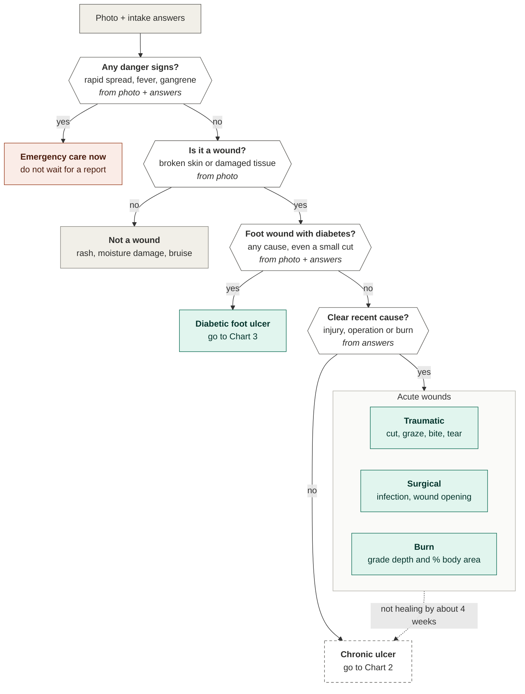
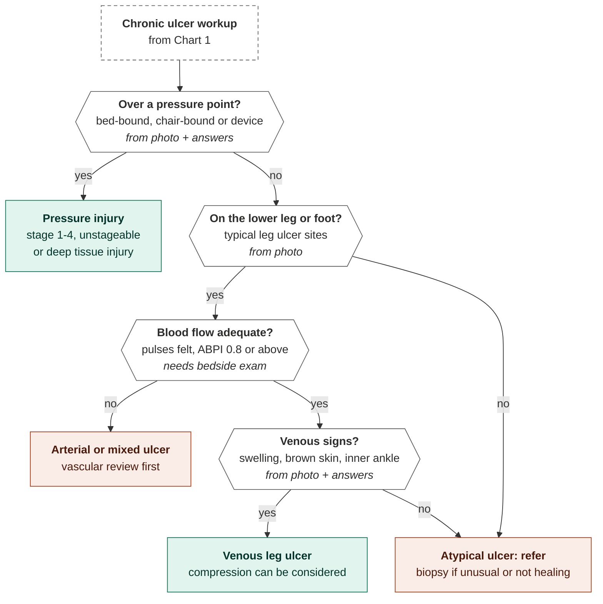
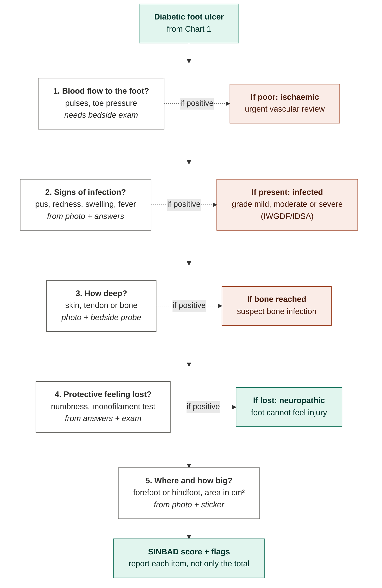

# Wound classification flowcharts

How a wound is sorted, in the order a clinician reasons: danger signs first, then
wound type, then grade. These charts are also the **labelling scheme** for the model
(level 1: danger / not a wound, level 2: wound type, level 3: grade and flags).

The diagrams are written in [Mermaid](https://mermaid.js.org). They render as
flowcharts on GitHub, in VS Code (Markdown preview with Mermaid support) and at
[mermaid.live](https://mermaid.live) if you paste a code block there. If your viewer
shows code instead of charts, open the PNG copies in `docs/img/`.

**Legend**

| Look | Meaning |
| --- | --- |
| Hexagon | A decision (yes / no) |
| White box | A check that always runs (Chart 3) |
| Green box | Wound type or descriptor |
| Orange box | Act now, refer, or urgent flag |
| Grey box | Starting point, or not a wound |
| Dashed box | Continues in another chart |
| *Italic line* | Where the information comes from: the photo, the intake answers, or a bedside exam the model cannot do |

> These charts support clinical reasoning; they are not a diagnosis. Every threshold
> and red-flag rule must be reviewed and signed off by your clinical partner.

---

## Chart 1: sort the wound (danger signs first)

**Why this order**

- **Danger signs come first.** A spreading infection or gangrene needs same-day care
  whatever the wound type, so nobody waits for a full classification.
- **Any foot wound in a person with diabetes is a diabetic foot ulcer**, even if it
  started as a small cut. It follows the diabetic foot checks in Chart 3.
- **Any acute wound that stalls** (not improving after about 4 weeks) moves into the
  chronic workup, whatever caused it.

**Danger signs to train and test for (high sensitivity)**

- Spreading redness with fever or chills
- Skin turning dusky or grey, or crackling under the finger
- Pain far worse than the wound looks
- Black or wet toes (gangrene)
- Burns that are large, electrical or chemical, or on the face, hands, feet, genitals or
  major joints

---

## Chart 2: chronic ulcers (check blood flow before calling it venous)

**Why blood flow is checked before venous**

Venous ulcers are treated with compression, which is dangerous if arterial supply is
poor. ABPI (ankle-brachial pressure index) compares ankle and arm blood pressure.
Guidelines disagree on exact cut-offs: most allow full compression from about 0.8
upward and differ below that. Readings can be falsely reassuring when arteries are
calcified, which is common in diabetes and kidney disease. Let your clinician set the
thresholds.

**The model cannot feel a pulse.** For every leg ulcer, the report must say
"blood flow not assessed: check before compression" unless a clinician has entered an
ABPI. It must never imply an ulcer is venous on the photo alone.

**Signs that an ulcer is atypical** (refer, consider biopsy)

- Unusual location for its apparent type
- Overgrown, cauliflower-like or "vegetative" tissue
- Undermined or purple edges, small satellite sores around it
- Severe pain, especially at dressing changes
- Failure to heal despite correct standard care

Causes include inflammatory disease (pyoderma gangrenosum, vasculitis), skin cancer,
clotting and kidney-related vessel disease, blood disorders (such as sickle cell),
infections (bacteria, mycobacteria, fungi, parasites) and some drugs.

---

## Chart 3: diabetic foot ulcer (every check runs; each can add a flag)

**Why a checklist, not a branching tree:** one ulcer can be ischaemic, infected and
deep at the same time, so every check runs and the flags add up.

**What IWGDF 2023 recommends**

- **SINBAD** (Site, Ischaemia, Neuropathy, Bacterial infection, Area, Depth) for
  communication between professionals; report each item, not only the total.
- **WIfI** for ulcers with peripheral artery disease.
- **IWGDF/IDSA grades** for infection.
- **No score** should be used to predict an individual patient's outcome.

---

## What this means for the model

| Rule | Implementation |
| --- | --- |
| Label in levels | Level 1: danger sign / not a wound. Level 2: wound type. Level 3: grade and flags. One output head per level. |
| Danger signs are the costliest miss | Set the danger-sign threshold for high sensitivity; accept more false alarms. |
| Bedside-exam steps are never guessed | Blood flow, probe-to-bone and monofilament results come from a clinician or are reported as "not assessed". |
| Intake answers are mandatory | Diabetes status and how the wound started decide the first branches; the photo cannot supply them. |
| Rare types are not separate classes | Pyoderma, cancer, infectious ulcers and similar go to "atypical: refer". |
| Describe, do not forecast | The report does not predict healing or amputation for an individual patient. |

The starter code's wound-type classifier currently treats types as flat classes. Next
changes: add the diabetic-foot rule from the intake answers, and the
"blood flow not assessed" flag for leg and foot ulcers.

---

## Sources

- [IWGDF 2023 classification guideline](https://iwgdfguidelines.org/wp-content/uploads/2023/07/IWGDF-2023-03-Classification-Guideline.pdf)
- [ABPI and compression: review of 13 clinical practice guidelines](https://journals.cambridgemedia.com.au/wpr/volume-27-no-2/ankle-brachial-pressure-index-and-compression-application-review-summary)
- [Atypical ulcers: diagnosis and management (Clinical Interventions in Aging)](https://www.dovepress.com/atypical-ulcers-diagnosis-and-management-peer-reviewed-fulltext-article-CIA)
